# Android-Studio

##### 这块区域共享的是在移动软件开发课程上的学习

主要是借助android studio来开发

- git从本地推送README.md文件按如下办法进行

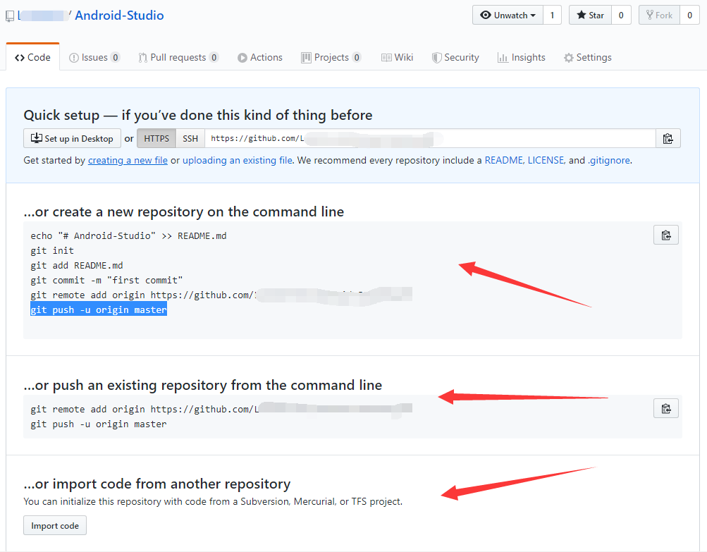

- 老师的教程：<https://blog.csdn.net/llfjfz/article/details/99747385>

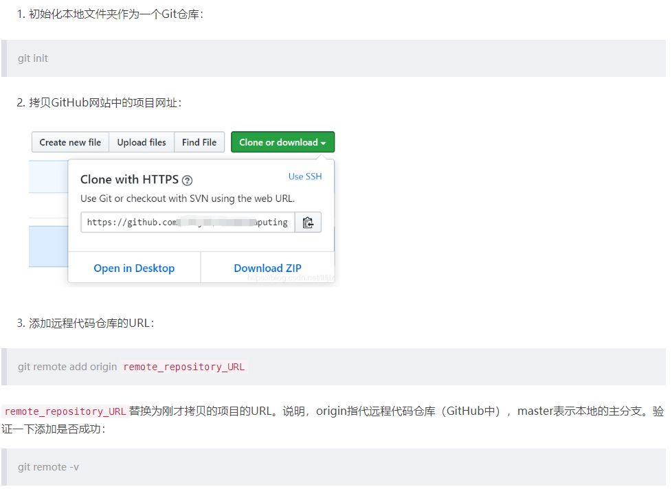

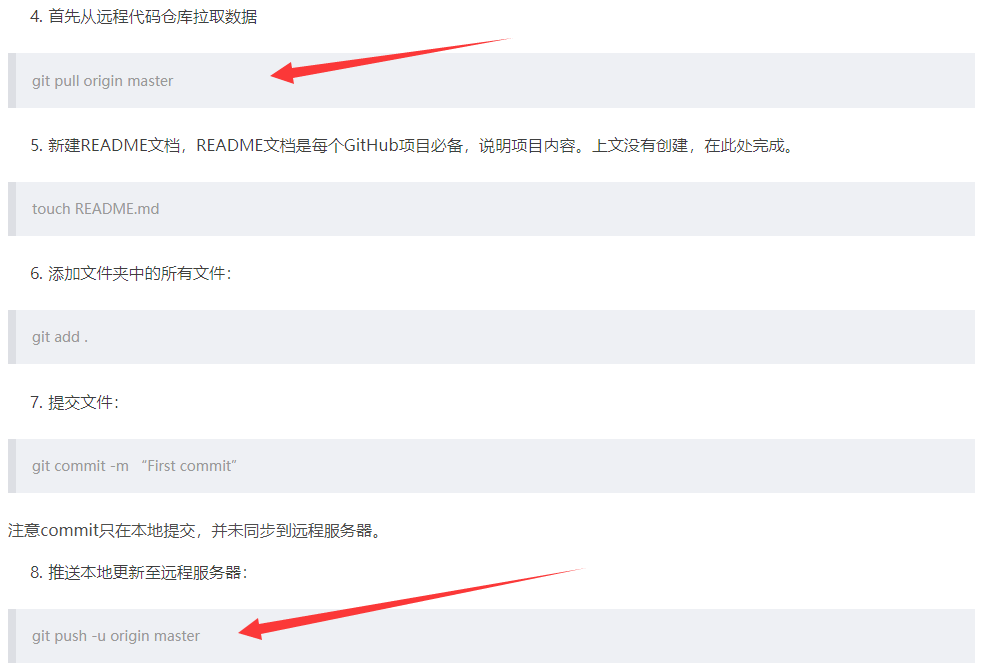

- 将创建好的安卓工程上传到github上：

- 参考教程：<https://blog.csdn.net/fjnu_se/article/details/66472625>

  ​                 <https://blog.csdn.net/u012145252/article/details/80628451>

  - 在安卓所在工程的位置右击选择Git Bash打开，并初始化本地仓库

    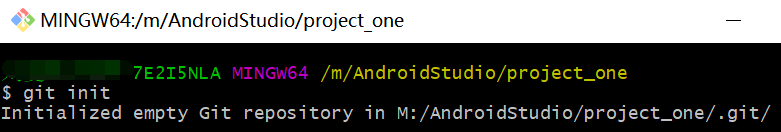

  - 编辑文件 .gitignore

    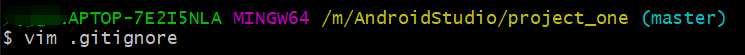

    输入如下内容：(如下图所示)

    - 注意：这里键入的内容说明指的是不需要推送到github上面的一些文件

    *.iml
    .gitignore.swp
    build/
    .gradle/
    .idea/
    local.properties
    app/build/
    app/libs/
    app/*.iml
    app/proguard-rules.pro
    app/src/androidTest/
    app/src/test/
    app/src/main/java/com/example/helloworld/MainActivity.java
    /local.properties
    /.idea/workspace.xml
    /.idea/libraries
    .DS_Store
    /build
    /captures
    .externalNativeBuild
    .cxx

    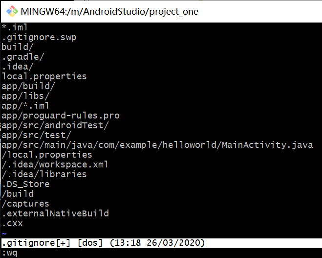

  - 将工程下面的所有文件添加到git本地仓库中

    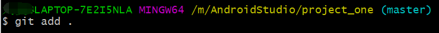

  - 接下来要提交

    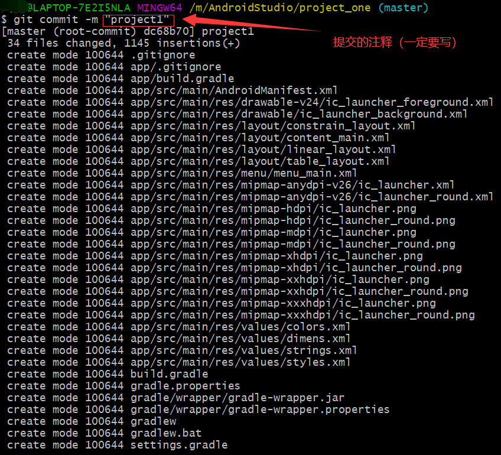

  - 在Git bash里先**添加**一下**远程仓库**

    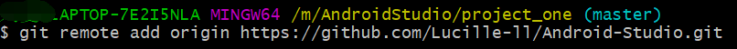

  - > 用**pull**将远程仓库里的一些文件同步到本地仓库
    >
    > > 因为本地仓库和远程仓库实际上是独立的两个仓库，所以在pull命令后紧接着使用--allow-unrelated-history可以用来
    > >
    > > 解决`fatal: refusing to merge unrelated histories`（拒绝合并不相关的历史）
    > >
    > > 如果输入 `git pull origin master` 没有这个fatal，就不用添加这个选项
    >
    > - 选项`--allow-unrelated-history`可以合并两个独立启动仓库的历史
    >
    > - 在键入指令 `git pull origin master --allow-unrelated-history`
    >
    > - 之后会有如下显示，只要随便输入 commit message  即可，但是一定要有输入

    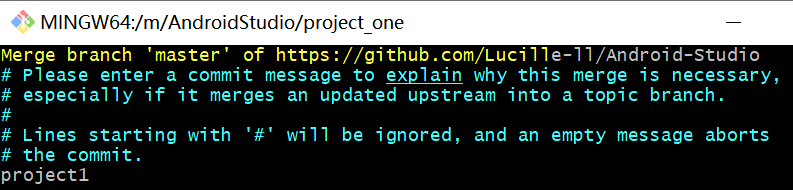

    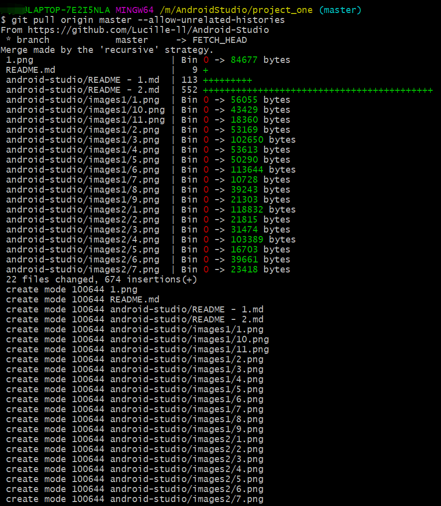

  - 最后将本地仓库的提交推送(**push**)到远程github仓库上

    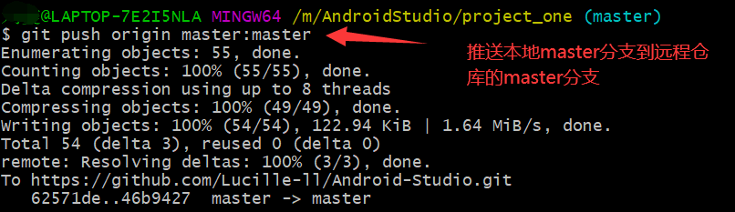

    

    

  

