# **Android UI**组件

## 一、**Android ListView**的用法

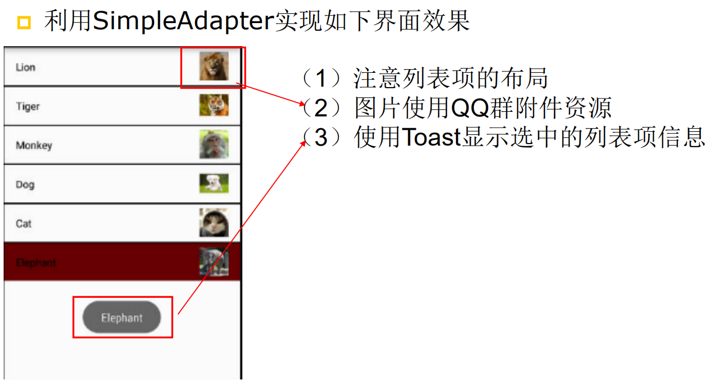

- MainActivity.java

  ``

  ```java
  package com.example.toast;
  
  import androidx.appcompat.app.AppCompatActivity;
  
  import android.os.Bundle;
  import android.widget.Button;
  import android.widget.Toast;
  
  public class MainActivity extends AppCompatActivity {
  
      @Override
      protected void onCreate(Bundle savedInstanceState) {
          super.onCreate(savedInstanceState);
          setContentView(R.layout.activity_main);
          Button lion = findViewById(R.id.lion);
          // 为按钮的单击事件绑定事件监听器
          lion.setOnClickListener(view -> {
              // 创建一个Toast提示信息
              Toast toast = Toast.makeText(MainActivity.this,
                      "Lion!!!!!", Toast.LENGTH_SHORT); // 设置该Toast提示信息的持续时间
              toast.show();
          });
          Button tiger = findViewById(R.id.tiger);
          // 为按钮的单击事件绑定事件监听器
          tiger.setOnClickListener(view -> {
              // 创建一个Toast提示信息
              Toast toast = Toast.makeText(MainActivity.this,
                      "Tiger!!!!!", Toast.LENGTH_SHORT); // 设置该Toast提示信息的持续时间
              toast.show();
          });
          Button monkey = findViewById(R.id.monkey);
          // 为按钮的单击事件绑定事件监听器
          monkey.setOnClickListener(view -> {
              // 创建一个Toast提示信息
              Toast toast = Toast.makeText(MainActivity.this,
                      "Monkey!!!!!", Toast.LENGTH_SHORT); // 设置该Toast提示信息的持续时间
              toast.show();
          });
          Button dog = findViewById(R.id.dog);
          // 为按钮的单击事件绑定事件监听器
          dog.setOnClickListener(view -> {
              // 创建一个Toast提示信息
              Toast toast = Toast.makeText(MainActivity.this,
                      "Dog!!!!!", Toast.LENGTH_SHORT); // 设置该Toast提示信息的持续时间
              toast.show();
          });
          Button cat = findViewById(R.id.cat);
          // 为按钮的单击事件绑定事件监听器
          cat.setOnClickListener(view -> {
              // 创建一个Toast提示信息
              Toast toast = Toast.makeText(MainActivity.this,
                      "Cat!!!!!", Toast.LENGTH_SHORT); // 设置该Toast提示信息的持续时间
              toast.show();
          });
          Button elephant = findViewById(R.id.elephant);
          // 为按钮的单击事件绑定事件监听器
          elephant.setOnClickListener(view -> {
              // 创建一个Toast提示信息
              Toast toast = Toast.makeText(MainActivity.this,
                      "Elephant!!!!!", Toast.LENGTH_SHORT); // 设置该Toast提示信息的持续时间
              toast.show();
          });
  
      }
  
  }
  ```

- activity_main.xml

  ``

  ```java
  <?xml version="1.0" encoding="utf-8"?>
  <LinearLayout xmlns:android="http://schemas.android.com/apk/res/android"
      android:orientation="vertical"
      android:layout_width="match_parent"
      android:layout_height="match_parent">
      <!-- 设置字号为20sp，在结尾处绘制图片  -->
      <Button
          android:id="@+id/lion"
          android:layout_width="match_parent"
          android:layout_height="68dp"
          android:background="@drawable/change"
          android:drawableRight="@drawable/lion"
          android:text="@string/Lion"
          android:gravity="left|center"
          android:paddingLeft="20dp"
          android:onClick="lion"
          android:textSize="20sp" />
  
      <!-- 设置字号为20sp，在结尾处绘制图片  -->
      <Button
          android:id="@+id/tiger"
          android:layout_width="match_parent"
          android:layout_height="55dp"
          android:background="@drawable/change"
          android:drawableRight="@drawable/tiger"
          android:gravity="left|center"
          android:paddingLeft="20dp"
          android:text="@string/Tiger"
          android:textSize="20sp" />
  
      <Button
          android:id="@+id/monkey"
          android:layout_width="match_parent"
          android:layout_height="68dp"
          android:background="@drawable/change"
          android:drawableRight="@drawable/monkey"
          android:text="@string/Monkey"
          android:gravity="left|center"
          android:paddingLeft="20dp"
          android:textSize="20sp" />
  
      <!-- 设置字号为20sp，在结尾处绘制图片  -->
      <Button
          android:id="@+id/dog"
          android:layout_width="match_parent"
          android:layout_height="wrap_content"
          android:background="@drawable/change"
          android:drawableRight="@drawable/dog"
          android:text="@string/Dog"
          android:gravity="left|center"
          android:paddingLeft="20dp"
          android:textSize="20sp" />
  
      <!-- 设置字号为20sp，在按钮结尾处绘制图片  -->
      <Button
          android:id="@+id/cat"
          android:layout_width="match_parent"
          android:layout_height="65dp"
          android:background="@drawable/change"
          android:drawableRight="@drawable/cat"
          android:text="@string/Cat"
          android:gravity="left|center"
          android:paddingLeft="20dp"
          android:textSize="20sp" />
  
      <Button
          android:id="@+id/elephant"
          android:layout_width="match_parent"
          android:layout_height="62dp"
          android:background="@drawable/change"
          android:drawableRight="@drawable/elephant"
          android:text="@string/Elephant"
          android:gravity="left|center"
          android:paddingLeft="20dp"
          android:textSize="20sp" />
  </LinearLayout>
  ```

- strings.xml

  ``

  ```java
  <resources>
      <string name="app_name">toast</string>
      <string name="Lion">Lion</string>
      <string name="Tiger">Tiger</string>
      <string name="Monkey">Monkey</string>
      <string name="Dog">Dog</string>
      <string name="Cat">Cat</string>
      <string name="Elephant">Elephant</string>
  </resources>
  ```

- drawable/change.xml

  ``

  ```java
  <?xml version="1.0" encoding="utf-8"?>
  <selector xmlns:android="http://schemas.android.com/apk/res/android">
  
          <item android:state_pressed="false"><!--没点击按钮的时候-->
              <shape android:shape="rectangle"><!--按钮形状-->
                  <solid android:color="#B06CB9B2" /><!--按钮背景填充色-->
                  <stroke
                      android:width="1dp"
                      android:color="#000000" /><!--按钮边框-->
              </shape>
          </item>
  
          <!--当点击按钮的时候变为蓝色-->
          <item android:drawable="@color/colorPrimary" android:state_pressed="true" />
  
  </selector>
  ```

- drawable中的png

  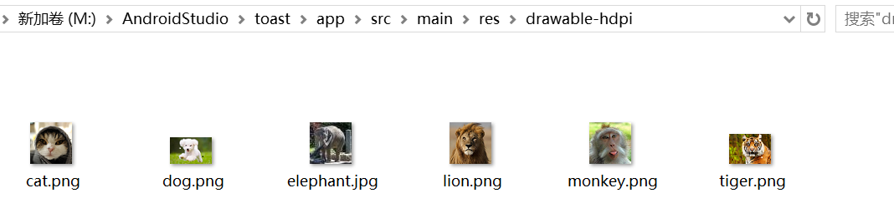

  <!--效果展示-->

  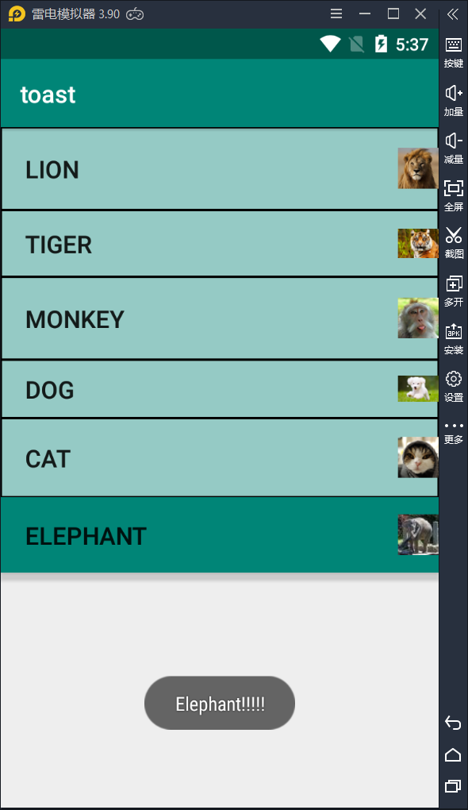

## 二、**创建自定义布局的**AlertDialog

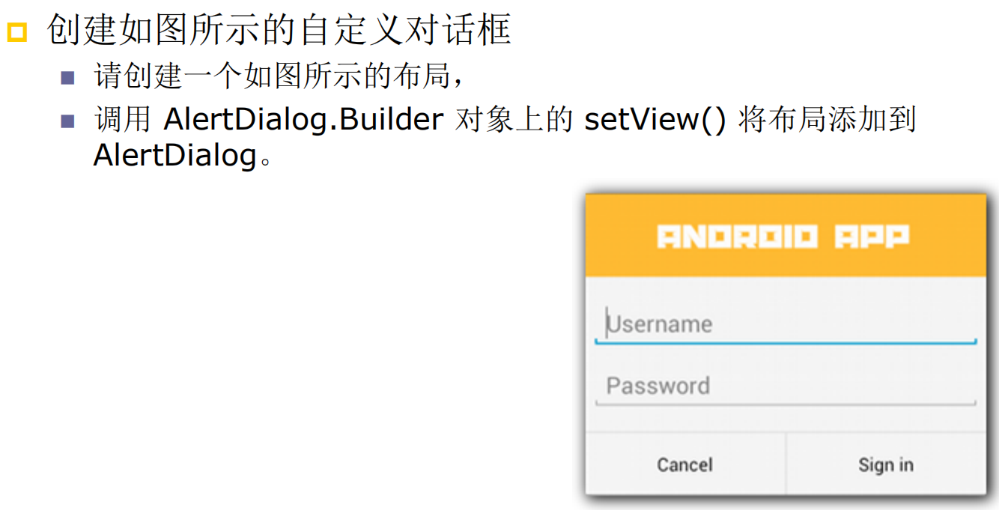

- MainActivity.java

  ``

  ```java
  package com.example.alertdialog;
  
  import androidx.appcompat.app.AppCompatActivity;
  import android.os.Bundle;
  import android.app.AlertDialog;
  import android.view.View;
  import android.widget.TableLayout;
  import android.widget.TextView;
  import android.widget.Toast;
  
  public class MainActivity extends AppCompatActivity {
      private TextView show;
      @Override
      protected void onCreate(Bundle savedInstanceState) {
          super.onCreate(savedInstanceState);
          setContentView(R.layout.activity_main);
      }
  
      public void customView(View source)
      {
          // 加载\res\layout\login.xml界面布局文件
          TableLayout loginForm = (TableLayout) getLayoutInflater().inflate(R.layout.login, null);
          new AlertDialog.Builder(this)
                  // 设置对话框的标题
                  .setTitle("ANDROID APP")
                  // 设置对话框显示的View对象
                  .setView(loginForm)
                  // 为对话框设置一个“确定”按钮
                  .setPositiveButton("Sign in", (dialog, which) -> {
                      // 此处可执行登录处理
                      // 创建一个Toast提示信息
                      Toast toast = Toast.makeText(MainActivity.this,
                              "Sign in!!!!!!", Toast.LENGTH_SHORT); // 设置该Toast提示信息的持续时间
                      toast.show();
                  })
                  // 为对话框设置一个“取消”按钮
                  .setNegativeButton("Cancel", (dialog, which) -> {
                      // 创建一个Toast提示信息
                      Toast toast = Toast.makeText(MainActivity.this,
                              "Exit!!!!!!", Toast.LENGTH_SHORT); // 设置该Toast提示信息的持续时间
                      toast.show();
                  })
                  // 创建并显示对话框
                  .create().show();
      }
  }
  ```

- activity_main.xml

  ``

  ```java
  <?xml version="1.0" encoding="utf-8"?>
  <LinearLayout xmlns:android="http://schemas.android.com/apk/res/android"
      android:layout_width="match_parent"
      android:layout_height="match_parent"
      android:gravity="center_horizontal"
      android:orientation="vertical">
  
      <!-- 定义一个普通的按钮组件 -->
      <Button
          android:layout_width="match_parent"
          android:layout_height="wrap_content"
          android:onClick="customView"
          android:text="@string/log" />
  </LinearLayout>
  ```

- login.xml

  ``

  ```java
  <?xml version="1.0" encoding="utf-8"?>
  <TableLayout xmlns:android="http://schemas.android.com/apk/res/android"
     android:id="@+id/loginForm"
     android:layout_width="match_parent"
     android:layout_height="match_parent">
  
     <TableRow android:paddingLeft="20dp">
        <!-- 输入用户名的文本框 -->
        <EditText
           android:layout_width="match_parent"
           android:layout_height="match_parent"
           android:layout_gravity="center_horizontal"
           android:hint="@string/user"
           android:selectAllOnFocus="true" />
     </TableRow>
  
     <TableRow android:paddingLeft="20dp">
        <!-- 输入密码的文本框 -->
        <EditText
           android:layout_width="match_parent"
           android:layout_height="wrap_content"
           android:hint="@string/password"
           android:inputType="textPassword" />
     </TableRow>
  
  </TableLayout>
  ```

- strings.xml

  ``

  ```java
  <resources>
      <string name="app_name">AlertDialog</string>
      <string name="user">Username</string>
      <string name="password">Password</string>
      <string name="log">Press to log in the app</string>
  </resources>
  ```

<!--效果展示-->

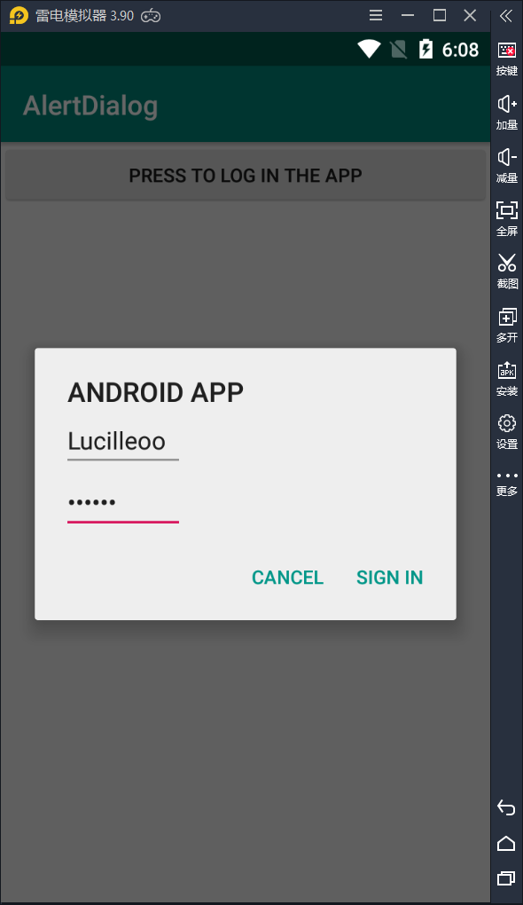

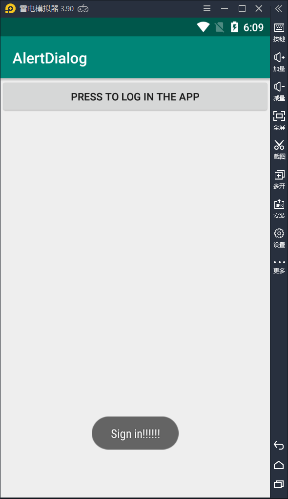

## 三、使用**XML**定义菜单

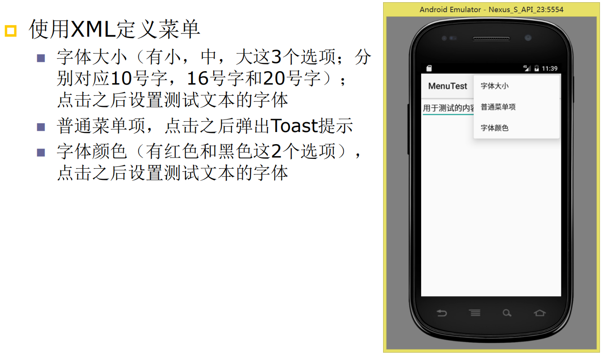

- MainActivity.java

  ``

  ```java
  package com.example.menutest;
  
  import androidx.appcompat.app.AppCompatActivity;
  
  import android.os.Bundle;
  import android.graphics.Color;
  import android.view.Menu;
  import android.view.MenuItem;
  import android.view.SubMenu;
  import android.widget.TextView;
  import android.widget.Toast;
  
  public class MainActivity extends AppCompatActivity
  {
      // 定义“字体大小”菜单项的标识
      private static final int FONT_10 = 0x111;
      private static final int FONT_12 = 0x112;
      private static final int FONT_14 = 0x113;
      private static final int FONT_16 = 0x114;
      private static final int FONT_18 = 0x115;
      // 定义“普通菜单项”的标识
      private static final int PLAIN_ITEM = 0x11b;
      // 定义“字体颜色”菜单项的标识
      private static final int FONT_RED = 0x116;
      private static final int FONT_BLUE = 0x117;
      private static final int FONT_GREEN = 0x118;
      private TextView text;
      @Override
      protected void onCreate(Bundle savedInstanceState)
      {
          super.onCreate(savedInstanceState);
          setContentView(R.layout.activity_main);
          text = findViewById(R.id.txt);
      }
      // 当用户单击MENU键时触发该方法
      @Override public boolean onCreateOptionsMenu(Menu menu)
      {
          // -------------向menu中添加“字体大小”的子菜单-------------
          SubMenu fontMenu = menu.addSubMenu("字体大小");
          // 设置菜单头的标题
          fontMenu.setHeaderTitle("选择字体大小");
          fontMenu.add(0, FONT_10, 0, "10号字体");
          fontMenu.add(0, FONT_12, 0, "12号字体");
          fontMenu.add(0, FONT_14, 0, "14号字体");
          fontMenu.add(0, FONT_16, 0, "16号字体");
          fontMenu.add(0, FONT_18, 0, "18号字体");
          // -------------向menu中添加“普通菜单项”-------------
          menu.add(0, PLAIN_ITEM, 0, "普通菜单项");
          // -------------向menu中添加“字体颜色”的子菜单-------------
          SubMenu colorMenu = menu.addSubMenu("字体颜色");
  
          colorMenu.setHeaderTitle("选择文字颜色");
          colorMenu.add(0, FONT_RED, 0, "红色");
          colorMenu.add(0, FONT_GREEN, 0, "绿色");
          colorMenu.add(0, FONT_BLUE, 0, "蓝色");
          return super.onCreateOptionsMenu(menu);
      }
      // 选项菜单的菜单项被单击后的回调方法
      @Override public boolean onOptionsItemSelected(MenuItem mi)
      {
          // 判断单击的是哪个菜单项，并有针对性地做出响应
          switch (mi.getItemId())
          {
              case FONT_10: text.setTextSize(10 * 2);    break;
              case FONT_12: text.setTextSize(12 * 2); break;
              case FONT_14: text.setTextSize(14 * 2); break;
              case FONT_16: text.setTextSize(16 * 2); break;
              case FONT_18: text.setTextSize(18 * 2); break;
              case FONT_RED: text.setTextColor(Color.RED); break;
              case FONT_GREEN: text.setTextColor(Color.GREEN); break;
              case FONT_BLUE: text.setTextColor(Color.BLUE); break;
              case PLAIN_ITEM:
                  Toast.makeText(MainActivity.this,
                          "您单击了普通菜单项", Toast.LENGTH_SHORT)
                          .show();
                  break;
          }
          return true;
      }
  }
  ```

- activity_main.xml

  ``

  ```java
  <?xml version="1.0" encoding="utf-8"?>
  <LinearLayout xmlns:android="http://schemas.android.com/apk/res/android"
      android:layout_width="match_parent"
      android:layout_height="match_parent"
      android:orientation="vertical">
  
      <TextView
          android:id="@+id/txt"
          android:padding="12dp"
          android:layout_width="match_parent"
          android:layout_height="wrap_content"
          android:text="@string/text" />
  </LinearLayout>
  ```

- strings.xml

  ``

  ```java
  <resources>
      <string name="app_name">MenuTest</string>
      <string name="text">用于测试的内容</string>
  </resources>
  ```

<!--效果展示-->

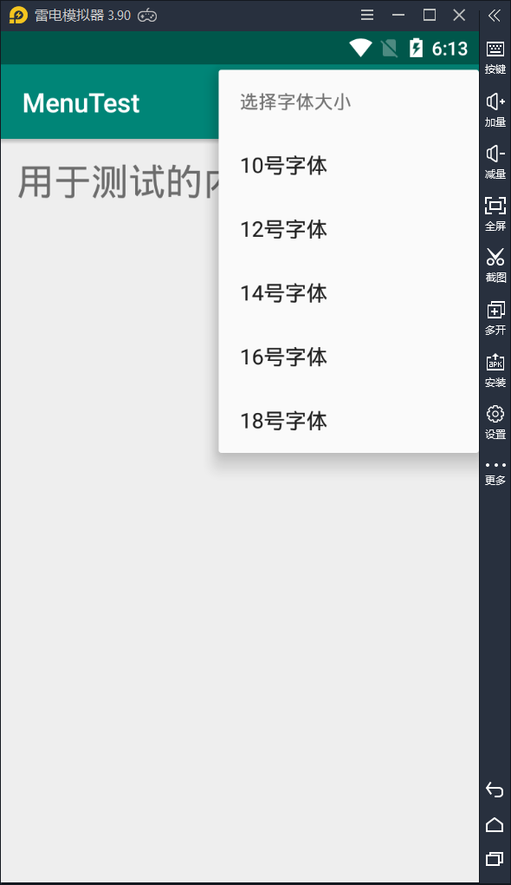


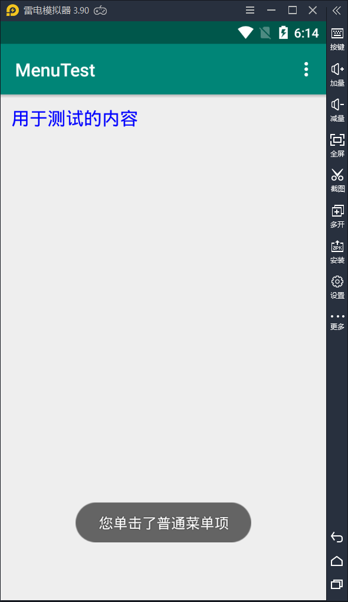

## 四、创建上下文操作模式**(ActionMode)**的上下文菜单

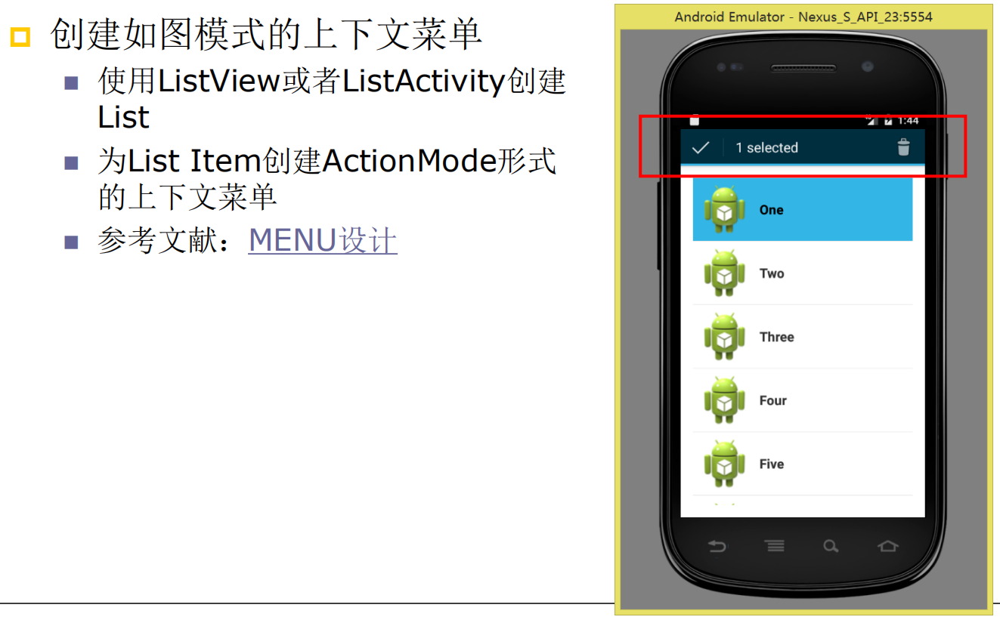

- MainActivity.java

  ``

  ```java
  package com.example.contextmenu;
  
  import androidx.appcompat.app.AppCompatActivity;
  import android.os.Bundle;
  import android.view.ActionMode;
  import android.view.Menu;
  import android.view.MenuInflater;
  import android.view.MenuItem;
  import android.widget.AbsListView;
  import android.widget.BaseAdapter;
  import android.widget.ListView;
  import java.util.ArrayList;
  import java.util.List;
  
  public class MainActivity extends AppCompatActivity {
  
      private ListView listView;
      private List<Item> list;
  
      private BaseAdapter adapter;
      private String [] name = {"One","Two","Three","Four","Five","Six"};
  
      @Override
      protected void onCreate(Bundle savedInstanceState) {
          super.onCreate(savedInstanceState);
          setContentView(R.layout.activity_main);
  
          listView = findViewById(R.id.list_view);
          list = new ArrayList<Item>();
          //定义item并且加入list中
          for(int i = 0; i < 6; i++){
              list.add(new Item(name[i], false));
          }
          //对listview进行适配器适配
          adapter = new AdapterCur(list,MainActivity.this);
          listView.setAdapter(adapter);
  
          //设置listview允许多选模式
          listView.setChoiceMode(ListView.CHOICE_MODE_MULTIPLE_MODAL);
          listView.setMultiChoiceModeListener(new AbsListView.MultiChoiceModeListener() {
              //选中数量
              int num = 0;
  
              /*
               * 参数：ActionMode是长按后出现的标题栏
               *        positon是当前选中的item的序号
               *    id 是当前选中的item的id
               *    checked 如果是选中事件则为true，如果是取消事件则为false
               */
              @Override
              public void onItemCheckedStateChanged(ActionMode mode, int position, long id, boolean checked) {
  
                  // 调整选定条目
                  if (checked == true) {
                      list.get(position).setBo(true);
                      //实时刷新
                      adapter.notifyDataSetChanged();
                      num++;
                  } else {
                      list.get(position).setBo(false);
                      //实时刷新
                      adapter.notifyDataSetChanged();
                      num--;
                  }
                  // 用TextView显示
                  mode.setTitle("  " + num + " Selected");
              }
  
              /*
               * 参数：ActionMode是长按后出现的标题栏
               *        Menu是标题栏的菜单内容
               */
              @Override
              public boolean onCreateActionMode(ActionMode mode, Menu menu) {
                  // 设置长按后所要显示的标题栏的内容
                  MenuInflater inflater = mode.getMenuInflater();
                  inflater.inflate(R.menu.activity_action_mode, menu);
                  num = 0;
                  adapter.notifyDataSetChanged();
                  return true;
  
              }
  
  
              /*
               * 可在此方法中进行标题栏UI的创建和更新
               */
              @Override
              public boolean onPrepareActionMode(ActionMode mode, Menu menu) {
  
                  adapter.notifyDataSetChanged();
                  return false;
              }
  
              public void refresh(){
                  for(int i = 0; i < 6; i++){
                      list.get(i).setBo(false);
                  }
              }
  
              /*
               * 可在此方法中监听标题栏Menu的监听，从而进行相应操作
               * 设置actionMode菜单每个按钮的点击事件
               */
              @Override
              public boolean onActionItemClicked(ActionMode mode, MenuItem item) {
                  switch (item.getItemId()) {
                      //全选
                      case R.id.menu_all:
                          num = 0;
                          refresh();
                          adapter.notifyDataSetChanged();
                          mode.finish(); // 偷了个懒，每个菜单按钮都设置返回，结束多选模式
                          return true;
                      //删除
                      case R.id.menu_delete:
                          adapter.notifyDataSetChanged();
                          num = 0;
                          refresh();
                          mode.finish();// 偷了个懒，每个菜单按钮都设置返回，结束多选模式
                          return true;
                      default:
                          refresh();
                          adapter.notifyDataSetChanged();
                          num = 0;
                          return false;
                  }
  
              }
  
              @Override
              public void onDestroyActionMode(ActionMode mode) {
                  refresh();
                  adapter.notifyDataSetChanged();
              }
  
          });
      }
  }
  ```

- Item.java

  ``

  ```java
  package com.example.contextmenu;
  
  public class Item {
      private String name;//显示的选项名
      private boolean bo;//记录是否被选中
  
      //带两个参数的构造函数
      public Item(String name, boolean bo){
          super();
          this.name = name;
          this.bo = bo;
      }
  
      //相应的get和toString方法
      public String getName() {
          return name;
      }
  
      public boolean isBo() {
          return bo;
      }
      public void setBo(boolean bo) {
          this.bo = bo;
      }
  
      @Override
      public String toString() {
          return "Item{" +
                  "name='" + name + '\'' +
                  ",bo=" + bo +
                  '}';
      }
  }
  ```

- AdapterCur.java

  ``

  ```java
  package com.example.contextmenu;
  
  import android.content.Context;
  import android.graphics.Color;
  import android.view.View;
  import android.view.ViewGroup;
  import android.widget.BaseAdapter;
  import android.widget.ImageView;
  import android.widget.TextView;
  import java.util.List;
  
  /*
   * 自定义的基于BaseAdapter的适配器
   * */
  public class AdapterCur extends BaseAdapter {
  
      List<Item> list;//item的list对象
      Context context;//上下文对象
  
      //初始化
      public AdapterCur(List<Item> list, Context context) {
          this.context = context;
          this.list = list;
          //列表同步方法
          notifyDataSetChanged();
      }
  
      //得到当前列表的选项数量
      public int getCount() {
          return list.size();
      }
  
      //根据下标得到列表项
      public Item getItem(int position) {
          return list.get(position);
      }
  
      public long getItemId(int position) {
          return 0;
      }
  
      public View getView(final int position, View convertView, ViewGroup parent) {
  
          final ViewHolder viewHolder;
          //如果还没加载
          if(convertView==null){
              //加载布局文件，并将各个选项以及每个选项中的内容一一对应
              convertView=View.inflate(context, R.layout.activity_content, null);
              viewHolder=new ViewHolder();
              viewHolder.imageView = convertView.findViewById(R.id.image);
              viewHolder.textView = convertView.findViewById(R.id.text_view);
              convertView.setTag(viewHolder);
          }else{
              viewHolder=(ViewHolder) convertView.getTag();
          }
  
          //得到十六进制的颜色的int值
          int PaleTurquoise = Color.parseColor("#AFEEEE");
          int white = Color.parseColor("#FFFFFF");
          viewHolder.textView.setText(list.get(position).getName());
          //如果被选中，那么改变选中颜色
          if(list.get(position).isBo() == true){
              viewHolder.textView.setBackgroundColor(PaleTurquoise);
              viewHolder.imageView.setBackgroundColor(PaleTurquoise);
          }
          else {
              viewHolder.textView.setBackgroundColor(white);
              viewHolder.imageView.setBackgroundColor(white);
          }
          return convertView;
  
      }
  
      //创建内部类，定义每一个列表项所包含的东西，这里是每个列表项都有一个imageView和textView。
      class ViewHolder{
          ImageView imageView;
          TextView textView;
      }
  }
  ```

- layout/activity_main.xml

  ``

  ```java
  <?xml version="1.0" encoding="utf-8"?>
  <androidx.constraintlayout.widget.ConstraintLayout
      xmlns:android="http://schemas.android.com/apk/res/android"
      xmlns:tools="http://schemas.android.com/tools"
      android:layout_width="match_parent"
      android:layout_height="match_parent"
      tools:context=".MainActivity">
  
      <LinearLayout android:layout_width="match_parent"
          android:layout_height="match_parent"
          android:orientation="vertical"
          tools:layout_editor_absoluteX="16dp"
          tools:layout_editor_absoluteY="0dp">
  
          <ListView
              android:id="@+id/list_view"
              android:layout_width="match_parent"
              android:layout_height="match_parent"
              android:choiceMode="multipleChoiceModal"/>
      </LinearLayout>
  </androidx.constraintlayout.widget.ConstraintLayout>
  ```

- layout/activity_content.xml

  ``

  ```java
  <?xml version="1.0" encoding="utf-8"?>
  <androidx.constraintlayout.widget.ConstraintLayout
      xmlns:android="http://schemas.android.com/apk/res/android"
      xmlns:app="http://schemas.android.com/apk/res-auto"
      android:layout_width="match_parent"
      android:layout_height="wrap_content"
      android:paddingTop="5dp"
      android:paddingBottom="5dp">
  
      <TextView
          android:id="@+id/text_view"
          android:layout_width="match_parent"
          android:layout_height="60dp"
          android:gravity="center_vertical"
          android:paddingLeft="60dp"
          app:layout_constraintBottom_toBottomOf="parent"
          app:layout_constraintTop_toTopOf="parent" />
  
      <ImageView
          android:id="@+id/image"
          android:layout_width="60dp"
          android:layout_height="60dp"
          android:src="@drawable/robot"
          app:layout_constraintEnd_toStartOf="@+id/text_view"
          app:layout_constraintHorizontal_bias="0.029"
          app:layout_constraintLeft_toLeftOf="@id/text_view"
          app:layout_constraintStart_toStartOf="parent"
          app:layout_constraintTop_toTopOf="parent" />
  
  </androidx.constraintlayout.widget.ConstraintLayout>
  ```

- menu/activity_action_mode.xml

  ``

  ```java
  <?xml version="1.0" encoding="utf-8"?>
  <menu xmlns:android="http://schemas.android.com/apk/res/android"
      xmlns:app="http://schemas.android.com/apk/res-auto">
  
      <item
          android:id="@+id/menu_all"
          app:showAsAction="always"
          android:icon="@drawable/select"
          android:title="item_all"/>
  
      <item
          android:id="@+id/menu_delete"
          app:showAsAction="always"
          android:icon="@drawable/dustbin"
          android:title="item_delete"/>
  </menu>
  ```

- values/strings.xml

  ``

  ```java
  <resources>
      <string name="app_name">ContextMenu</string>
  </resources>
  ```

- drawable的png

  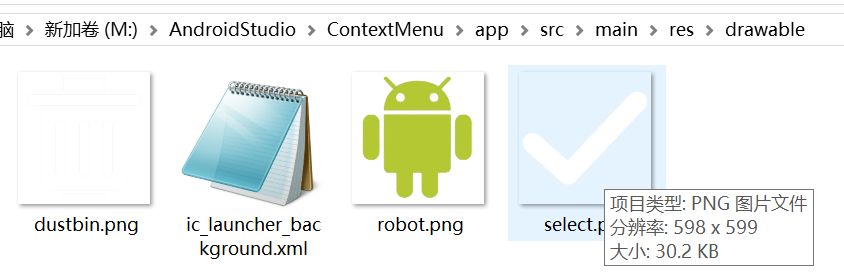

<!--效果展示-->

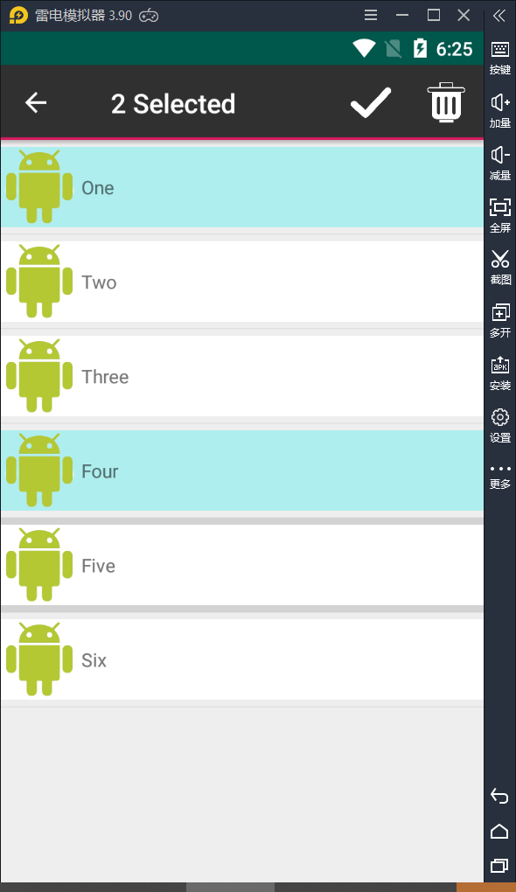


<!--源代码放在Android-Studio-Code2-->

