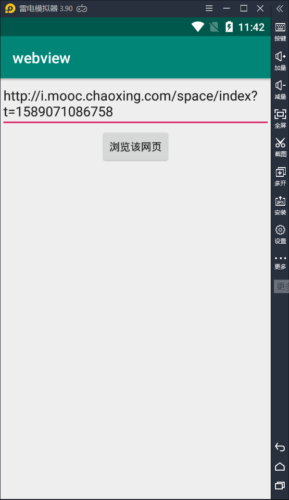
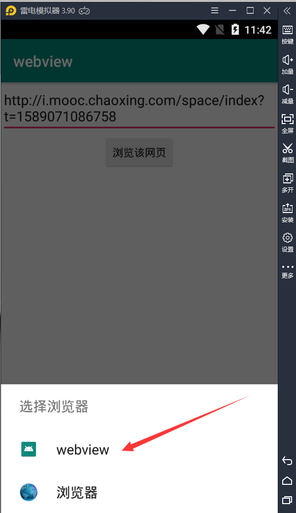
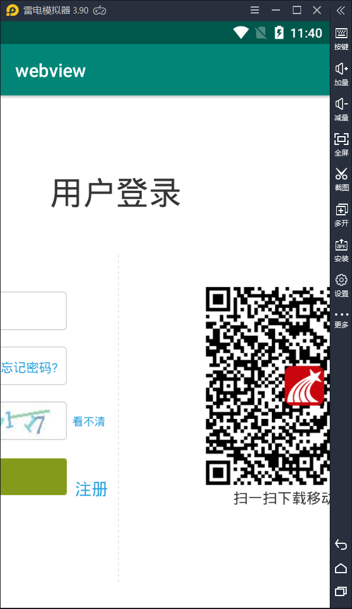

# 实验4：自定义**WebView**验证隐式**Intent**的使用

**一、包含两个应用：**

- 第一个应用：获取URL地址并启动隐式Intent的调用。 

- 第二个应用：自定义WebView来加载URL。

**二、具体编程如下：**

- MainActivity.java:

``

```java
package com.example.webview;

import androidx.appcompat.app.AppCompatActivity;
import android.os.Bundle;
import android.content.Intent;
import android.net.Uri;
import android.view.View;
import android.widget.EditText;

public class MainActivity extends AppCompatActivity {
    private EditText url;
    @Override
    protected void onCreate(Bundle savedInstanceState) {
        super.onCreate(savedInstanceState);
        setContentView(R.layout.activity_main);
        url= findViewById(R.id.url); //定义获取URL地址
    }

    public void toweb(View source){//定义页面视图的跳转
        Intent intent=new Intent();  //启动隐式Intent的调用
        intent.setAction(Intent.ACTION_VIEW);
        intent.setData(Uri.parse(url.getText().toString()));
        Intent choose=Intent.createChooser(intent,"选择浏览器");
        startActivity(choose);
    }
}
```

- webview.java

``

```java
package com.example.webview;

import android.os.Bundle;
import android.webkit.WebSettings;
import android.webkit.WebView;
import android.webkit.WebViewClient;

import androidx.appcompat.app.AppCompatActivity;

public class webview extends AppCompatActivity {

    private WebView web; //自定义webview来加载URL

    @Override
    protected void onCreate(Bundle savedInstanceState) {
        super.onCreate(savedInstanceState);
        setContentView(R.layout.activity_webview);
        web = findViewById(R.id.web);
        String url=getIntent().getDataString();//用于接收url
        WebSettings webSettings=web.getSettings();
        webSettings.setJavaScriptEnabled(true);
        webSettings.setSupportZoom(true);
        webSettings.setAllowFileAccess(true);
        webSettings.setAllowContentAccess(true);
        web.loadUrl(url);//使用自定义的web去加载url
        web.setWebViewClient(new WebViewClient(){//使用自定义的web打开url
            @Override
            public boolean shouldOverrideUrlLoading(WebView view, String url) {
                web.loadUrl(url);
                return true;
            }
        });
    }
}
```

- activity_main.xml

``

```java
<?xml version="1.0" encoding="utf-8"?>
<androidx.constraintlayout.widget.ConstraintLayout
    xmlns:android="http://schemas.android.com/apk/res/android"
    xmlns:app="http://schemas.android.com/apk/res-auto"
    xmlns:tools="http://schemas.android.com/tools"
    android:layout_width="match_parent"
    android:layout_height="match_parent"
    tools:context=".MainActivity">

    <EditText
        android:id="@+id/url"
        android:layout_width="match_parent"
        android:layout_height="wrap_content"
        android:hint="输入网址"
        app:layout_constraintLeft_toLeftOf="parent"
        app:layout_constraintRight_toRightOf="parent"
        app:layout_constraintTop_toTopOf="parent" />
    <Button
        android:onClick="toweb"
        android:layout_width="wrap_content"
        android:layout_height="wrap_content"
        android:text="浏览该网页"
        app:layout_constraintRight_toRightOf="parent"
        app:layout_constraintLeft_toLeftOf="parent"
        app:layout_constraintTop_toBottomOf="@id/url"/>

</androidx.constraintlayout.widget.ConstraintLayout>
```

- activity_webview.xml

``

```java
<?xml version="1.0" encoding="utf-8"?>
<LinearLayout
    xmlns:android="http://schemas.android.com/apk/res/android"
    android:layout_width="match_parent"
    android:layout_height="match_parent">
    //自定义webview视图
    <WebView
        android:layout_width="match_parent"
        android:layout_height="match_parent"
        android:id="@+id/web">
    </WebView>
</LinearLayout>
```

- AndroidManifest.xml

``

```java
<?xml version="1.0" encoding="utf-8"?>
<manifest xmlns:android="http://schemas.android.com/apk/res/android"
    package="com.example.webview">

    <application
        android:allowBackup="true"
        android:icon="@mipmap/ic_launcher"
        android:label="@string/app_name"
        android:roundIcon="@mipmap/ic_launcher_round"
        android:supportsRtl="true"
        android:theme="@style/AppTheme"
        android:usesCleartextTraffic="true">
        <activity android:name=".MainActivity">
            <intent-filter>
                <action android:name="android.intent.action.MAIN" />

                <category android:name="android.intent.category.LAUNCHER" />
            </intent-filter>
        </activity>
        <activity android:name=".webview">
            <intent-filter>
                <action android:name="android.intent.action.VIEW"></action>
                <data android:scheme="http"/>
                <data android:scheme="https"/>
                <category android:name="android.intent.category.DEFAULT"/>
            </intent-filter>
        </activity>
    </application>
    <uses-permission android:name="android.permission.INTERNET" />

</manifest>
```

- 页面效果示意图





