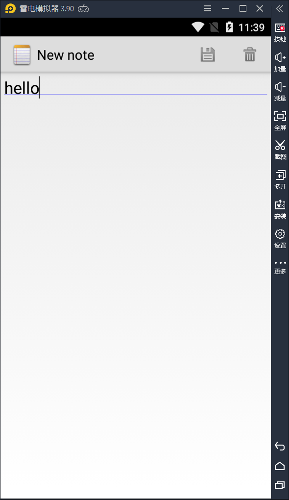
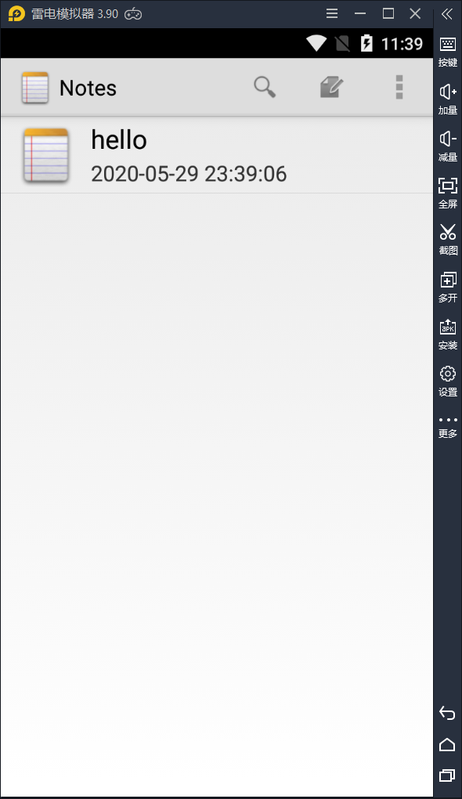
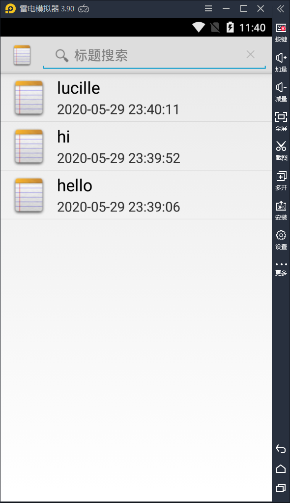
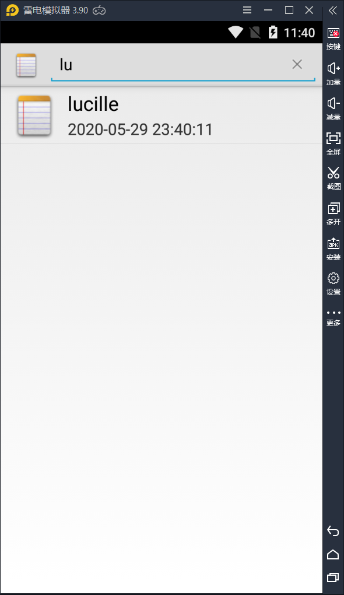

# NotePad**笔记本应用**

1. 下载NotePad源码：https://github.com/llfjfz/NotePad 

2. 阅读NotePad的源代码并做如下扩展： （完整工程放到仓库Android_Studio_Code4<https://github.com/Lucille-ll/Android_Studio_Code4>)

- NoteList中显示条目增加时间戳显示 

  - 步骤一：在布局文件中添加时间戳的textview

    - `

      ```java
      <TextView xmlns:android="http://schemas.android.com/apk/res/android"
                  android:id="@+id/time1"
                  android:layout_width="match_parent"
                  android:paddingLeft="10dp"
                  android:layout_height="20dp"
                  android:textSize="18dp"
                  android:singleLine="true"
                  />
      ```

      `

  - 步骤二：在保存Note的时候也要保存当时的时间戳，即在保存Note所调用的updateNote这个函数中添加一个获取时间戳的功能getFormatData

    - `

      ```java
      // Sets up a map to contain values to be updated in the provider.
          ContentValues values = new ContentValues();
          values.put(NotePad.Notes.COLUMN_NAME_MODIFICATION_DATE, getFormatData()); 
      ```

      `

    - 而getFormatData函数实现获取时间戳

      ``

      ```java
      @TargetApi(Build.VERSION_CODES.N)
      public String getFormatData(){
          long time=System.currentTimeMillis();//long now = android.os.SystemClock.uptimeMillis();
          SimpleDateFormat format=new SimpleDateFormat("yyyy-MM-dd HH:mm:ss");//获取自定义时间戳
          Date mdata=new Date(time);
          String mtime=format.format(mdata);
          return mtime;
      }
      
      
      ```

    - 效果如图：

      

      

- 添加笔记查询功能（根据标题查询） 

  - 步骤一：使用SearchView实现用户搜索输入框，并实现setOnQueryTextListener监听事件onQueryTextChange，用于实时监听搜索框内容

    ``

    ```java
    @Override
                public boolean onQueryTextChange(String s) {
                    /* Performs a managed query. The Activity handles closing and requerying the cursor
                     * when needed.
                     *
                     * Please see the introductory note about performing provider operations on the UI thread.
                     */
                    String mslection = new String (NotePad.Notes.COLUMN_NAME_TITLE+" LIKE '%"+s+"%'"  );
                    String[] mArgs = new String[] {  s  };
                    Cursor cursor = managedQuery(
                            getIntent().getData(),            // Use the default content URI for the provider.
                            PROJECTION,                       // Return the note ID and title for each note.
                            mslection,                             // No where clause, return all records.
                            null,                             // No where clause, therefore no where column values.
                            NotePad.Notes.DEFAULT_SORT_ORDER  // Use the default sort order.
                    );
                    Log.e(TAG, "查询到条数 --> " + cursor.getCount());
    
                    /*
                     * The following two arrays create a "map" between columns in the cursor and view IDs
                     * for items in the ListView. Each element in the dataColumns array represents
                     * a column name; each element in the viewID array represents the ID of a View.
                     * The SimpleCursorAdapter maps them in ascending order to determine where each column
                     * value will appear in the ListView.
                     */
    
                    // The names of the cursor columns to display in the view, initialized to the title column
                    String[] dataColumns = { NotePad.Notes.COLUMN_NAME_TITLE , NotePad.Notes.COLUMN_NAME_MODIFICATION_DATE } ;
    
                    // The view IDs that will display the cursor columns, initialized to the TextView in
                    // noteslist_item.xml
                    int[] viewIDs = { android.R.id.text1, R.id.time1 };
    
                    // Creates the backing adapter for the ListView.
                    adapter.changeCursor(cursor);
    
                    // Sets the ListView's adapter to be the cursor adapter that was just created.
                    setListAdapter(adapter);
                    Log.d(TAG, "TextChange --> " + s);
                 //   LogUtil.e(NextActivity.class, "TextChange --> " + s);
                    return false;
                }
          
    ```

  - 步骤二：使用sql 的like实现包含查询

    `String mslection = new String (NotePad.Notes.COLUMN_NAME_TITLE+" LIKE '%"+s+"%'"  );`

  - 效果如图：

    

    


